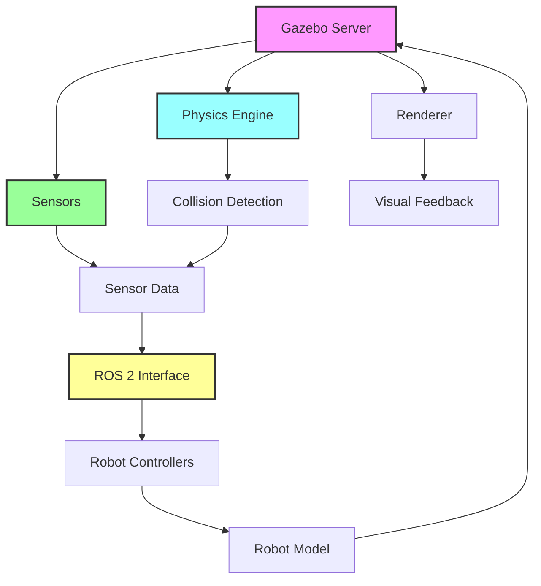

# Chapter 1: Gazebo Fundamentals

## Learning Goals

By the end of this chapter, you will be able to:
- Understand the purpose of Gazebo as the robotic simulation environment
- Create and configure basic world files with physics parameters
- Spawn humanoid robots in the simulation environment
- Tune physics parameters like gravity and collision settings

## What is Gazebo?

Gazebo is a robot simulation environment that provides high-fidelity physics simulation, realistic rendering, and convenient programmatic interfaces. For humanoid robotics, Gazebo allows you to test algorithms, validate controllers, and simulate sensors without the risk and cost of real hardware.

## The Gazebo Environment

Gazebo simulates a 3D environment where robots interact with objects and physics. The core components are:

- **Physics Engine**: Simulates gravity, collisions, and forces
- **Renderer**: Provides visual feedback for debugging and visualization
- **Sensors**: Simulates various sensor types (LiDAR, cameras, IMUs, etc.)
- **Plugins**: Extend functionality through custom code

## World Files

World files define the environment in which your robot operates. They specify:

- Physical properties (gravity, magnetic field, etc.)
- Models (robots, objects, obstacles)
- Lighting and visual settings
- Physics engine parameters

### Creating a Basic World File

In our [basic-world.world](/downloads/gazebo-examples/world-files/basic-world.world) file, we define:

1. The physics engine with 1ms step size and Earth gravity
2. A ground plane and sun for lighting
3. A simple test box to verify physics simulation

For a more detailed example, see our [detailed-physics-world.world](/downloads/gazebo-examples/world-files/detailed-physics-world.world) which demonstrates:
1. More advanced physics engine parameters
2. Different collision properties for objects
3. Options for tuning gravity and friction

### Physics Engine Configuration

The physics engine is configured with several important parameters:

- `max_step_size`: The time increment for each simulation step (0.001s = 1ms)
- `real_time_factor`: Target speed relative to real time (1.0 = real-time)
- `gravity`: Gravitational acceleration vector (0, 0, -9.8 m/s²)

## Spawning Robots

Robots in Gazebo are defined as models with links and joints. Our [simple humanoid](/downloads/gazebo-examples/humanoid-models/simple-humanoid.urdf) example demonstrates:

- A base link representing the torso
- Fixed joints connecting limbs
- Basic geometric shapes for collision and visualization

## Physics Tuning

Physics parameters can dramatically affect simulation behavior. Key parameters include:

- **Gravity**: Affects how objects fall (default: 9.8 m/s² on Earth)
- **Damping**: Simulates friction and air resistance
- **Material properties**: Affects how objects interact on contact

### Example: Adjusting Gravity

To simulate different environments, you can adjust gravity:
- Moon: -1.62 m/s² (about 1/6 of Earth)
- Mars: -3.71 m/s² (about 1/3 of Earth)
- Zero-G: 0.0 m/s² (no gravitational pull)

## Exercises

1. Modify the gravity in the basic world file to simulate lunar gravity and observe the difference in how the humanoid moves
2. Create a new world file with a ramp and test how the humanoid interacts with it
3. Adjust the collision properties of the humanoid's links and observe how it affects movement

## Visualizing Gazebo Architecture

Here's a diagram showing how the different components of the Gazebo simulation environment interact:

## Next Steps

In the next chapter, we'll explore how to simulate sensors like LiDAR, cameras, and IMUs in Gazebo to generate realistic sensor data for your humanoid robot.